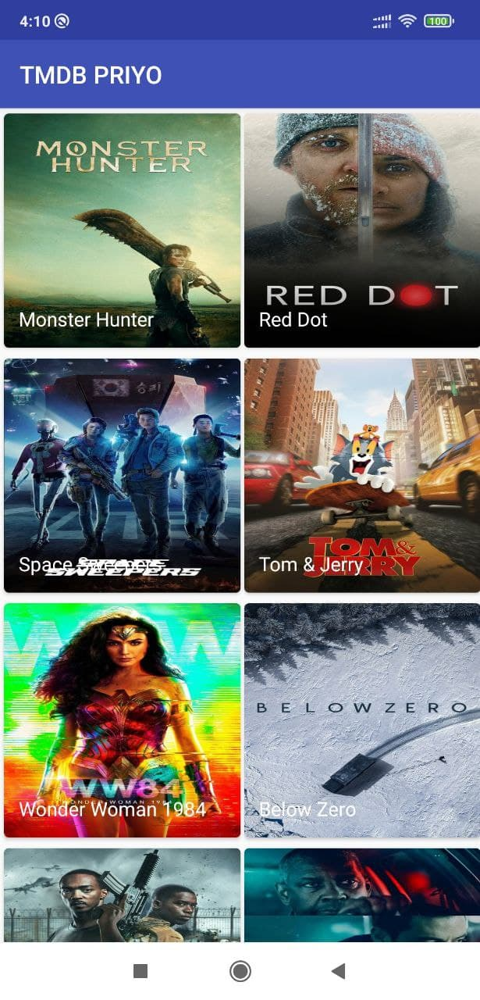
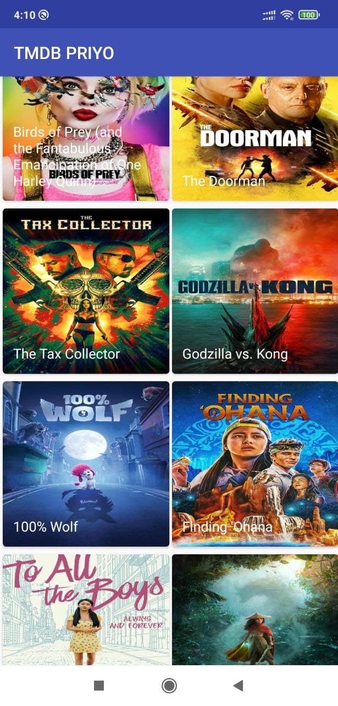
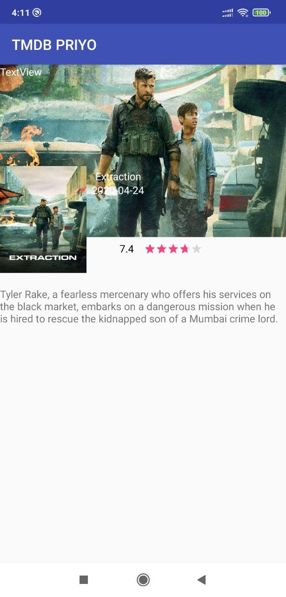
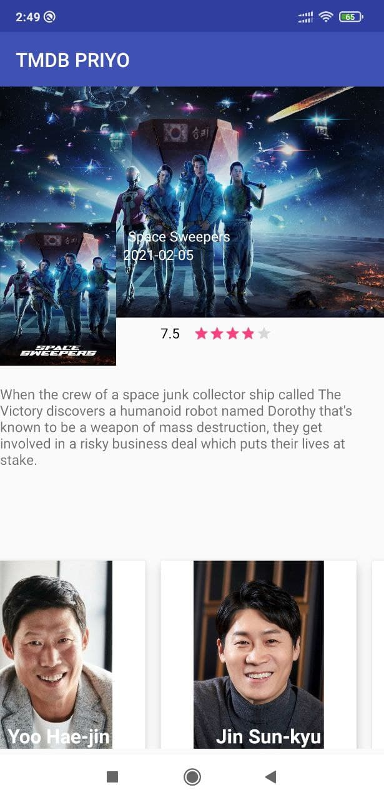

# TMDB App
## Preface
This app is an open movie database app. One can see the movie lists, casts, ratings, details about different movies.  

## Features
Completed Features:
1.	Fetch the popular movie list from the given API and display it in a GridView.
2.	Endless Scroll using paging library.
3.	Show the cover photo of the movie.
4.	Show the poster of the movie.
5.	Show the title of the movie.
6.	Show the summary of the movie.
7.	Show the rating of the movie.
8.	Show the release date of the movie.
9.  Show the cast of the movie.

## How To Run It
Open the project in IntellIJ and build it. Connect it with a real device using USB cable and it will run. 

## Screenshots

## Future Works
* Make a user profile
